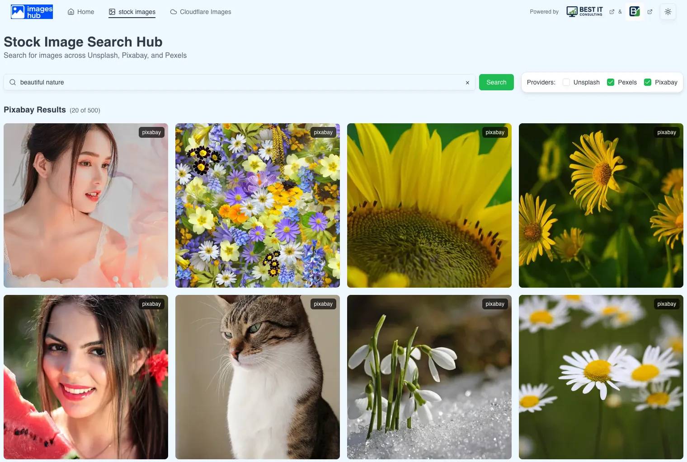
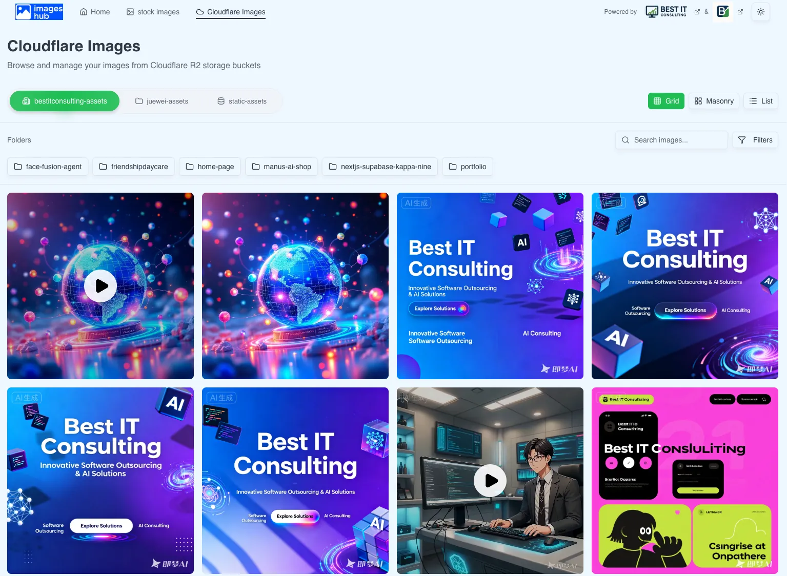
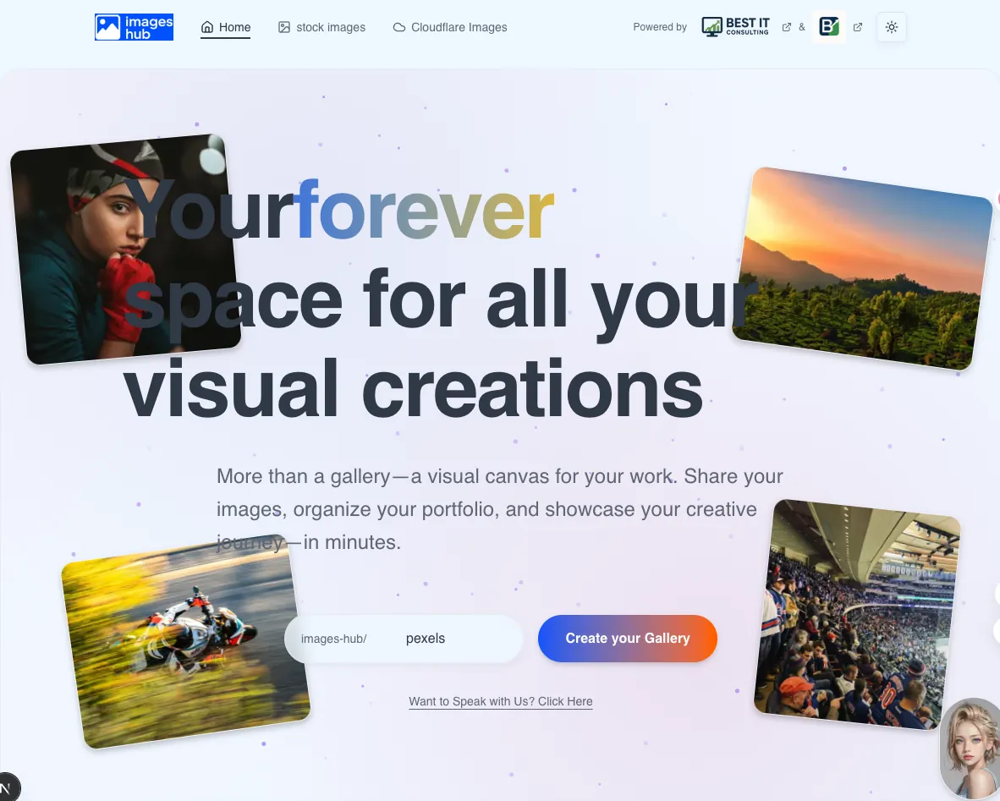
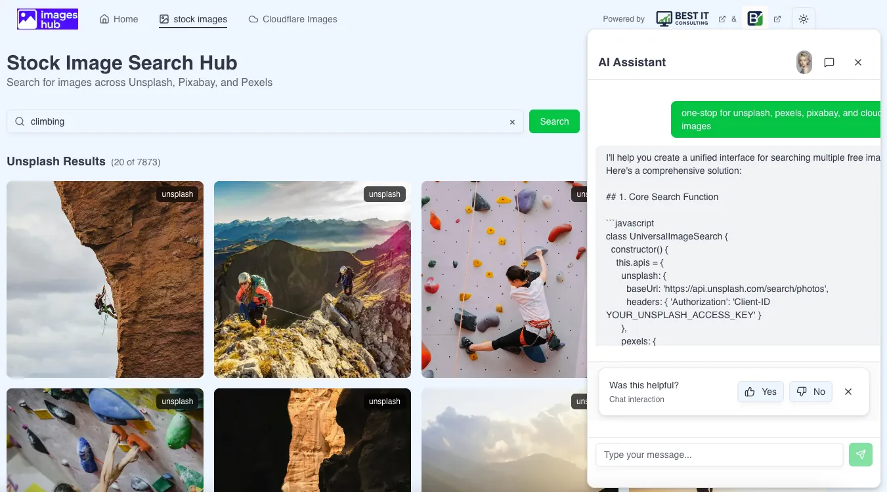

# AI Chatbot

A modern Next.js application featuring AI-powered chat, unified stock image search, and cloud media gallery management.

## 📸 Screenshots

<div align="center">
  <a href="https://images-hub-pim.vercel.app/" target="_blank">
    
  </a>
  <a href="https://images-hub-pim.vercel.app/" target="_blank">
    
  </a>
</div>

<div align="center">
  <a href="https://images-hub-pim.vercel.app/" target="_blank">
    
  </a>
  <a href="https://images-hub-pim.vercel.app/" target="_blank">
    
  </a>
</div>

## 🚀 Features

### AI Chat Widget

- **Floating Chat Interface**: Non-intrusive chat widget accessible from any page
- **Real-time Streaming**: Powered by DeepSeek LLM via Vercel AI Gateway
- **Chat History**: Persistent conversation history with localStorage
- **Error Handling**: Comprehensive error handling with retry mechanisms
- **Authentication Required**: Secure chat access with Clerk authentication

### Stock Image Search Hub (Home Page)

- **Unified Search**: Search across Unsplash, Pixabay, and Pexels from a single interface
- **Provider Filtering**: Select which providers to search (multi-select)
- **Masonry Grid Layout**: Pinterest-style responsive layout
- **Grouped Results**: Results organized by provider with clear section headers
- **Image Modals**: Detailed image view with attribution and metadata
- **Infinite Scroll**: Seamless pagination with lazy loading
- **Rate Limit Handling**: Graceful handling of API rate limits

### Cloudflare R2 Media Gallery

- **Multi-Bucket Support**: Browse images and videos from multiple R2 buckets
- **Bucket Sidebar**: Stable left-side bucket list (`bestitconsulting-assets`, `juewei-assets`, `static-assets`, `friendshipdaycare`)
- **Folder Tree Panel**: Middle column shows an expandable folder tree (Windows Explorer–style)
- **Multiple Display Modes**: Grid, Masonry, and List views for the right-hand content area
- **Video Support**: View videos alongside images with dedicated video player
- **Search & Filter**: Filter by file type and search within buckets
- **Responsive Design**: Optimized for all screen sizes

### Authentication & Security

- **Clerk Integration**: Secure user authentication and session management
- **Role-Based Access Control**: User and admin roles with permission system
- **Protected Routes**: All pages require authentication (except sign-in/sign-up)
- **API Security**: Authentication checks on all API routes

## 🛠️ Tech Stack

- **Framework**: Next.js 16 (App Router)
- **Language**: TypeScript (strict mode)
- **Styling**: Tailwind CSS 4
- **UI Components**: shadcn/ui (Radix UI primitives)
- **Authentication**: Clerk
- **AI**: Vercel AI SDK + DeepSeek LLM
- **Storage**: Cloudflare R2, AWS S3 SDK
- **Animations**: Framer Motion
- **Deployment**: Vercel

## 📋 Prerequisites

- Node.js 18+ and pnpm (or npm/yarn)
- Vercel account
- Clerk account with API keys
- DeepSeek API key
- Cloudflare R2 credentials (for R2 gallery feature)

## 🚦 Getting Started

### 1. Clone the Repository

```bash
git clone <repository-url>
cd ai-chatbot
```

### 2. Install Dependencies

```bash
pnpm install
# or
npm install
# or
yarn install
```

### 3. Environment Variables

Create a `.env.local` file in the project root:

```env
# Clerk Authentication (required)
# Get your keys from https://dashboard.clerk.com
NEXT_PUBLIC_CLERK_PUBLISHABLE_KEY=pk_test_your-publishable-key-here
CLERK_SECRET_KEY=sk_test_your-secret-key-here
NEXT_PUBLIC_CLERK_SIGN_IN_URL=/sign-in
NEXT_PUBLIC_CLERK_SIGN_UP_URL=/sign-up
NEXT_PUBLIC_CLERK_AFTER_SIGN_IN_URL=/
NEXT_PUBLIC_CLERK_AFTER_SIGN_UP_URL=/

# DeepSeek API Key (required for local development)
# Get your API key from https://platform.deepseek.com
DEEPSEEK_API_KEY=sk-your-deepseek-api-key-here

# Cloudflare R2 (required for R2 gallery feature)
# Get your credentials from Cloudflare Dashboard
R2_ACCOUNT_ID=your-r2-account-id
R2_ACCESS_KEY_ID=your-r2-access-key-id
R2_SECRET_ACCESS_KEY=your-r2-secret-access-key
R2_BUCKET_BESTITCONSULTING=bestitconsulting-assets
R2_BUCKET_JUEWEI=juewei-assets
R2_BUCKET_STATIC=static-assets
R2_ENDPOINT=https://your-account-id.r2.cloudflarestorage.com
```

**Important**: Never commit `.env.local` to version control. It's already in `.gitignore`.

### 4. Run Development Server

```bash
pnpm dev
# or
npm run dev
# or
yarn dev
```

Open [http://localhost:3000](http://localhost:3000) in your browser.

**Note**: You must sign in before accessing any features. Click "Sign In" in the header to authenticate.

## 📁 Project Structure

```
ai-chatbot/
├── app/                      # Next.js App Router pages
│   ├── api/                  # API routes
│   │   ├── chat/             # AI chat API endpoint
│   │   ├── images-hub/       # Image search API
│   │   └── r2/               # R2 media API (list, image)
│   ├── cloudflare-images/    # R2 media gallery page
│   ├── stock-images/         # Stock image search page
│   ├── sign-in/               # Clerk sign-in page
│   ├── sign-up/               # Clerk sign-up page
│   ├── layout.tsx             # Root layout with Clerk provider
│   └── page.tsx               # Home page (Portrait-style landing)
├── components/                # React components
│   ├── chat-widget/           # Floating chat widget
│   ├── images-hub/            # Stock image search components
│   ├── r2-images/             # R2 gallery components
│   └── ui/                     # shadcn/ui components
├── lib/                       # Utility libraries
│   ├── auth.ts                # Authentication helpers
│   ├── hub/                   # Image search aggregator
│   ├── r2/                     # R2 client utilities
│   └── hooks/                  # Custom React hooks
├── types/                      # TypeScript type definitions
└── middleware.ts              # Clerk middleware for route protection
```

## 🔐 Authentication Setup

This application uses [Clerk](https://clerk.com) for authentication.

### Clerk Configuration

1. Create a Clerk account at [https://dashboard.clerk.com](https://dashboard.clerk.com)
2. Create a new application
3. Copy your API keys:
   - `NEXT_PUBLIC_CLERK_PUBLISHABLE_KEY`
   - `CLERK_SECRET_KEY`
4. Add them to your `.env.local` file
5. Configure allowed URLs in Clerk Dashboard → Settings → Domains:
   - `http://localhost:3000` (for local development)
   - Your production domain (for deployment)

### Role-Based Access Control

The application supports role-based permissions:

- **User Role**: Default role with access to chat and image features
- **Admin Role**: Additional admin permissions (configured via Clerk publicMetadata)

To assign admin role:

1. Go to Clerk Dashboard → Users
2. Select a user
3. Edit publicMetadata: `{ "role": "admin" }`

## 🤖 AI Gateway Setup

This project uses Vercel AI Gateway to route requests to DeepSeek LLM.

### Local Development

For local development, the app uses the DeepSeek provider directly:

- Set `DEEPSEEK_API_KEY` in `.env.local`
- The API route will use `@ai-sdk/deepseek` provider directly

### Production (Vercel)

For production deployment on Vercel:

1. **Add Credit Card** (Required):
   - Vercel AI Gateway requires a valid credit card on file, even for the free tier ($5/month free credits)
   - Add your card at: https://vercel.com/d?to=%2F%5Bteam%5D%2F%7E%2Fai%3Fmodal%3Dadd-credit-card

2. **Configure DeepSeek API Key**:
   - Go to Vercel Dashboard → **AI Gateway** → **Integrations** (left sidebar)
   - Find **Deepseek** in the provider list and click **Add**
   - Enter your Deepseek API key and click **Test Key** to validate
   - Ensure the **Enabled** toggle is turned on
   - Click **Add** to save

3. **Verify Model Availability**:
   - Go to Vercel Dashboard → AI Gateway → Model List
   - Search for "deepseek" and verify the model identifier is `deepseek/deepseek-chat`

**Note**:

- The free tier includes $5 USD of AI Gateway Credits per month
- For local development, use `.env.local` with `DEEPSEEK_API_KEY`
- For production, configure it in AI Gateway Integrations (not Environment Variables)

See [docs/SETUP.md](./docs/SETUP.md) for detailed setup instructions.

## 📄 Available Routes

- `/` - Stock Image Search Hub (home page)
- `/r2-images` - Cloudflare R2 Media Gallery
- `/sign-in` - Sign in page (Clerk)
- `/sign-up` - Sign up page (Clerk)
- Chat widget is accessible from any page (floating button)

## 🧪 Development Commands

```bash
# Start development server
pnpm dev

# Build for production
pnpm build

# Start production server
pnpm start

# Run linter
pnpm lint

# Format code
pnpm format

# Check formatting
pnpm format:check
```

## 🚀 Deployment

### Deploy to Vercel

The easiest way to deploy is using the [Vercel Platform](https://vercel.com/new):

1. Push your code to GitHub/GitLab/Bitbucket
2. Import your repository in Vercel
3. Configure environment variables in Vercel Dashboard:
   - Clerk keys (`NEXT_PUBLIC_CLERK_PUBLISHABLE_KEY`, `CLERK_SECRET_KEY`)
   - R2 credentials (if using R2 gallery)
   - **Do NOT** add `DEEPSEEK_API_KEY` here - configure it in AI Gateway Integrations instead
4. Configure DeepSeek API key in Vercel Dashboard → AI Gateway → Integrations
5. Deploy!

### Environment Variables for Production

In Vercel Dashboard → Settings → Environment Variables, add:

- All Clerk environment variables
- All R2 environment variables (if using R2 gallery)
- **Do NOT** add `DEEPSEEK_API_KEY` - it should be configured in AI Gateway Integrations

## 📚 Documentation

- [Setup Guide](./docs/SETUP.md) - Detailed setup instructions
- [Implementation Docs](./docs/) - Feature implementation summaries
- [Specs](./specs/) - Feature specifications and plans

## 🎯 Key Features Details

### Chat Widget

- Accessible via floating button (bottom-right corner)
- Chat history persists across page navigation
- Streaming responses with error handling
- 60-second timeout per request
- Token limit: 8000 tokens per message

### Stock Image Search

- Searches three providers simultaneously
- Results grouped by provider
- Provider filtering with checkboxes
- Infinite scroll pagination
- Rate limit handling with retry logic

### R2 Media Gallery

- Left bucket sidebar for multiple asset buckets
- Middle folder tree panel for subfolders
- Multiple display modes (Grid, Masonry, List)
- Video playback support
- File type filtering

## 🤝 Contributing

1. Follow TypeScript strict mode conventions
2. Use functional React components with TypeScript
3. Prefer Tailwind CSS utility classes
4. Use shadcn/ui components when possible
5. Maintain accessibility standards (WCAG AA)
6. Write comprehensive error handling

## 📝 License

[Add your license here]

## 🙏 Acknowledgments

- Powered by [Best IT Consulting](https://www.bestitconsulting.ca) & [Best IT Consultants](https://www.bestitconsultants.ca)
